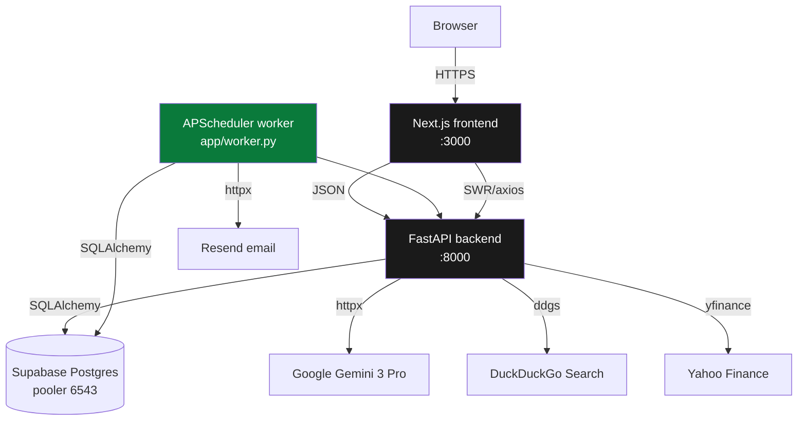
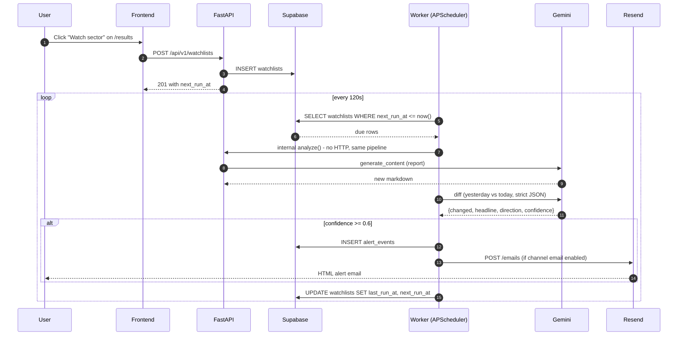
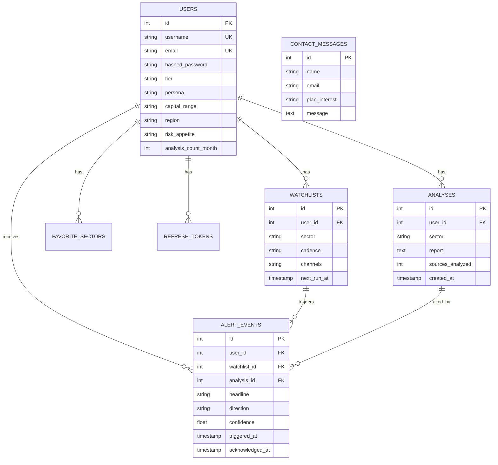

# TradeInsight AI — Architecture & Product Guide

> How the app works end-to-end, who it's for, and what makes it different from "yet another GPT wrapper."

---

## 1. The one-paragraph pitch

TradeInsight AI takes a sector name (*"pharmaceuticals"*, *"fintech"*) and returns a structured, **citation-backed**, **persona-aware** analysis of that sector in the Indian market — backed by **live NSE data**, **real news with sentiment scoring**, and a **scheduled alerts engine** that tells you when something material changes. Built for people who'd otherwise spend half a day reading Moneycontrol, Economic Times and broker PDFs to form one opinion.

---

## 2. The problem it solves

| Who | What hurts today | What we replace |
|-----|------------------|-----------------|
| **Retail investor** | News overload. Three tabs open, still doesn't know if banking is a buy. | A single sector brief with live index numbers, news sentiment and citations. |
| **MSME exporter** | "Which countries want my product now?" requires hours of DGFT / trade-data scrolling. | A persona-tuned report framed around HS codes, target markets and tariff tailwinds. |
| **SME owner** | Evaluating a new line of business, no cheap sector research. | A 0-6-12 month launch checklist generated from current market data. |
| **Consultant / analyst** | Billing hourly to write sector decks. | One-click PPT export, persona-framed, source-cited. |
| **B-school / CFA / UPSC student** | Hand-writing sector case studies with scattered sources. | Citation-grade markdown exportable to PDF/Word. |

The pain is the same across all five: **making sense of unstructured sector news faster than you can Ctrl-F your way through it**.

---

## 3. High-level workflow

```mermaid
flowchart LR
    U[User types "pharmaceuticals"] --> F[Next.js /dashboard]
    F -->|POST /api/v1/analyze| B[FastAPI]
    B --> C{Cache hit?}
    C -->|yes| R1[Return cached report + sources]
    C -->|no| PIPE[[Research pipeline]]

    subgraph PIPE [Research pipeline]
        direction TB
        S1[1. Collect web news<br/>DDG news + text + Gemini grounding]
        S2[2. Enrich each article<br/>VADER sentiment + timestamps]
        S3[3. Pull live market data<br/>yfinance NSE sector indices]
        S4[4. Gemini 3 Pro<br/>persona-aware prompt<br/>'cite with N']
        S5[5. Post-process report<br/>metadata + citation chips]
        S1 --> S2 --> S3 --> S4 --> S5
    end

    PIPE --> SAVE[(Supabase Postgres<br/>analyses, sources)]
    SAVE --> RESP[Return report + sources list]
    RESP --> FE[/results page renders<br/>markdown + 5 live charts/]
```

---

## 4. What happens when you click "Analyze"

A step-by-step for the `/api/v1/analyze/{sector}` endpoint:

1. **Validation** — regex sanitises the sector name, 2-100 chars.
2. **Access control**
   - Guest? Only "technology" or "pharmaceuticals" allowed.
   - Authenticated? Tier-based monthly counter: free=5, pro=100, enterprise=∞. Monthly reset is automatic.
3. **Cache check** — an in-process TTL cache (30 min) keyed on sector name. Cache hits return instantly with the same `sources[]` list so citation chips keep working.
4. **Web research** — `DataCollector.search_sector_news()` issues 3 parallel DDG `text` queries (sector trading ops, market news, import-export trends) with a `news` fallback when DDG throttles the text endpoint. Up to 10 articles returned with URL + title + snippet + timestamp.
5. **Persona lookup** — if the user has set a persona in `/settings` (investor / exporter / sme_owner / student / consultant), that context is threaded into the Gemini system prompt.
6. **Gemini 3 Pro call** — structured prompt with strict citation rules (*"claims sourced from item N cite as [N]; do not invent numbers"*). Markdown output, 7-section template covering Executive Summary → Opportunities → Drivers → Risks → Recommendations → Contacts.
7. **Post-processing** — `ReportGenerator.add_metadata()` prepends YAML frontmatter. Report and enriched sources list are cached.
8. **Persistence** — authenticated users get the report written to the `analyses` table in Supabase, and their monthly counter is incremented atomically.
9. **Response** — JSON with `{id, sector, report, sources_analyzed, sources[], timestamp, cached}`. `sources[]` is what powers the clickable `[N]` chips on the frontend.

---

## 5. Data flow across services



Three long-running services (backend, frontend, worker) plus Supabase (managed). Gemini, Yahoo, DDG and Resend are synchronous HTTP calls.

---

## 6. Alert pipeline (watchlists + scheduler)



Key invariant: the worker **always** advances `next_run_at` even if the tick throws, so one broken watchlist can't busy-loop.

---

## 7. Database schema (Supabase Postgres)

7 tables, all managed by SQLAlchemy models in `app/database.py`.



Forward-only schema migrations run idempotently at `init_db()` startup — adding a nullable column never requires manual SQL on Supabase.

---

## 8. /results page — what the reader sees

Five live-data cards + the AI report.

| Card | Source | What it answers |
|------|--------|-----------------|
| **Sector Vitals** | `/sectors/{s}/market-data` | "What did this sector do today?" Live NSE close, day change, range, 52w, benchmark vs Nifty. |
| **12-month Trend** | `/sectors/{s}/market-data` | "How's the sector done over the year?" recharts area chart + total % change. |
| **Relative Strength** | `/sectors/{s}/relative-strength` | "Is capital flowing *into* this sector?" 6-month normalised sector vs Nifty 50 comparison. |
| **Sector Correlations** | `/sectors/correlations` | "What else moves with this?" 10×10 green/red correlation heatmap, 90-day daily returns. |
| **Social Sentiment** | `/sectors/{s}/news` | "What's the tone of recent news?" Live news items with VADER sentiment chips, average score badge. |
| **Gemini report + Sources** | `/analyze/{s}` | The 7-section markdown with citation chips and a numbered sources block. |

Everything is real data. No `Math.sin()`, no seeded mock arrays.

---

## 9. Features that stand out

Grouped by who they matter to.

### Credibility signals
- **Citation chips** — `[N]` inline links back to the original news URL; a numbered "Sources" block at the end of every report. Nobody has to trust us blindly.
- **Real NSE / Yahoo Finance data** — not just copy that *sounds* like market analysis.
- **VADER sentiment** on every news item with per-card aggregate.
- **Correlation heatmap** across 10 sector indices — tells the reader what *else* moves with this sector.

### Recurring-value engine
- **Watchlists** with hourly / daily / weekly cadence (free=1 slot, pro=20, enterprise=∞).
- **APScheduler worker** re-runs the full pipeline automatically and Gemini-diffs old vs new reports.
- **Email delivery via Resend** for alerts when confidence ≥ 0.6 (WhatsApp slot reserved).
- **In-app unread badge** in the sidebar polls every 60s.

### Persona-aware personalization
- Five reader frames (**investor / exporter / sme_owner / student / consultant**) that branch the Gemini system prompt.
- Soft onboarding banner on `/dashboard` for new users — 30 seconds to personalise.
- Same Gemini call cost, radically different output voice.

### Workflow tools
- **Multi-sector compare** — parallel `asyncio.gather`, Gemini-ranked leaderboard with racing bars, capital-required / time-to-ROI / top-opportunity / top-risk per sector.
- **Export dropdown** — Markdown / PDF / Excel / PowerPoint. PPTX is Pro-gated with a clean 402 upsell.
- **Pricing-page honesty** — every promise on `/pricing` is actually implemented or tied to a visible Pro gate.

### Ops / DX
- **Supabase Postgres** via `psycopg[binary]` v3 pooler — one `.env` value to move from local SQLite to prod.
- **Three-service docker-compose** (backend, frontend, worker) brings the whole stack up with `docker compose up --build`.
- **Graceful degradation everywhere** — Gemini mock mode, VADER heuristic fallback for diffs, yfinance `unavailable` payloads, DDG news fallback for DDG text, no-op email notifier when API key is absent.

---

## 10. Tech stack at a glance

| Layer | Choice | Why |
|-------|--------|-----|
| Frontend | Next.js 14 (App Router) + Tailwind + framer-motion + recharts | Fast, static-first, great auth story with our own backend |
| Backend | FastAPI + Pydantic v2 | Async HTTP, generated OpenAPI, cheap to host |
| Database | Supabase Postgres (pooler) via `psycopg[binary]` v3 | Managed, scales, one env var to switch |
| LLM | Google Gemini 3 Pro / Flash | Low latency, big context, JSON mode |
| Market data | `yfinance==1.3.0` + `curl_cffi` | Real NSE indices without scraping |
| News + sentiment | `ddgs` + `vaderSentiment` | No API keys needed |
| Scheduler | `APScheduler` BlockingScheduler | Simpler than Celery for this scale |
| Email | Resend HTTP API via `httpx` | Clean REST, cheap, no SDK |
| Auth | JWT + refresh tokens (house-rolled) | Matches the FastAPI-first architecture |
| Exports | `reportlab` + `openpyxl` + `python-pptx` | All pure-Python, no system deps |
| Isolation | Docker compose (backend / frontend / worker) | Worker independence prevents API stalls |

---

## 11. Known limits / conscious trade-offs

- **News research is snippet-based today.** DDG returns title + body excerpt only. See §12 for the upgrade in progress — switching to Gemini's `google_search` grounding tool so the model fetches full articles itself.
- **No market_snapshots history table.** yfinance serves 12 months on demand; we don't store our own baseline yet. Will add when the alert diff engine needs a stored reference.
- **WhatsApp delivery.** Notifier protocol is already defined — adding a `GupshupWhatsAppNotifier` is the same shape as `ResendEmailNotifier`, just needs an account.
- **No Celery / Redis.** Single-worker APScheduler is sufficient until watchlist volume exceeds ~1000 active sectors/cadence.
- **SQLite fallback still wired** — SQLite path in `database.py` kept for quick local dev without Supabase.

---

## 12. What's changing next (research upgrade)

The biggest quality unlock in flight right now: replace the thin DDG-snippet pipeline with **Gemini's native `google_search` grounding**. Gemini does its own web queries, fetches the actual article content, and returns the report together with structured grounding metadata (URLs, titles, segment offsets). That's the upgrade this session is landing — see the next commit.

After that, the report prompt gets expanded to explicitly request:
- **Stock-level suggestions** (with entry/exit zones for investors, HS codes for exporters, etc.)
- **Timing buckets** — what's happening *now*, what's forming for the next 3-6 months
- **Cross-sector impact** — "if this plays out in pharma, here's how IT / banking / FMCG move with it"

---

*Last updated: 2026-04-19*
