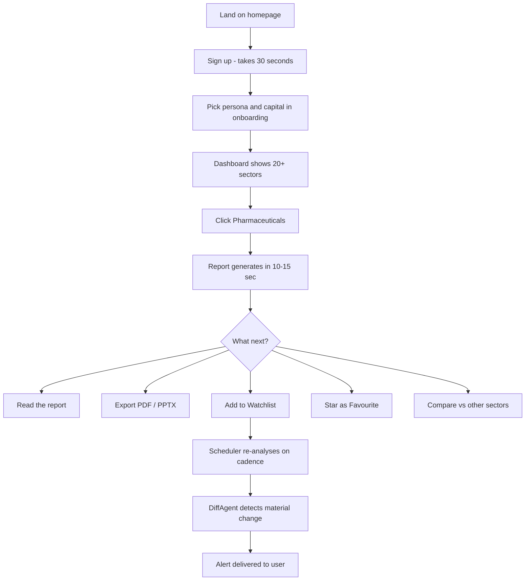
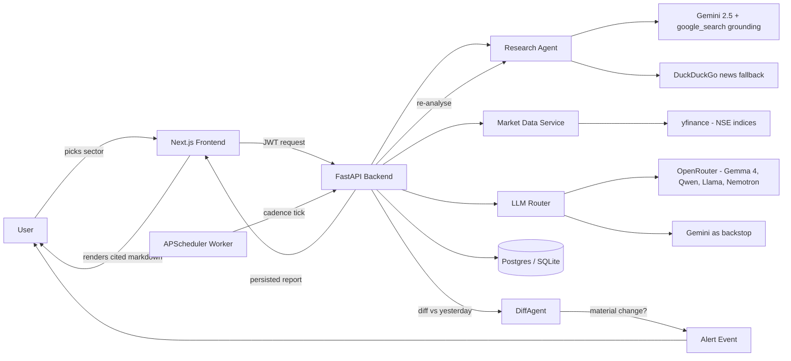

# TradeInsight AI — The Pitch

> _An AI research analyst for Indian equity markets. Pick a sector. Get a report written for you — cited, structured, and tailored to your persona — in under fifteen seconds._

---

## Contents

1. [The one-line pitch](#1-the-one-line-pitch)
2. [The 30-second pitch](#2-the-30-second-pitch)
3. [Why this exists — the problem](#3-why-this-exists--the-problem)
4. [What TradeInsight is — the solution](#4-what-tradeinsight-is--the-solution)
5. [Who this is for](#5-who-this-is-for)
6. [How a user experiences it](#6-how-a-user-experiences-it)
7. [Features at a glance](#7-features-at-a-glance)
8. [Under the hood — how it works](#8-under-the-hood--how-it-works)
9. [The tech stack](#9-the-tech-stack)
10. [What makes it different (the moat)](#10-what-makes-it-different-the-moat)
11. [Business model](#11-business-model)
12. [Roadmap highlights](#12-roadmap-highlights)
13. [FAQ](#13-faq)
14. [Appendix — one-slide summary](#14-appendix--one-slide-summary)

---

## 1. The one-line pitch

**TradeInsight AI is Bloomberg Terminal's research desk, compressed into a single sentence: "Analyse this sector for me."**

---

## 2. The 30-second pitch

Retail investors in India are drowning in information and starving for understanding. The news is everywhere, but structured sector analysis still costs ₹20,000+ a month and ships as a PDF on a two-day delay. We built TradeInsight AI so anyone — from a Zerodha-first retail investor to an exporter scanning new markets — can type a sector name and get a **citation-backed, persona-tuned report** in under fifteen seconds.

Behind the scenes, an **agentic AI pipeline** reads news and filings, pulls live NSE index data, and runs structured reasoning through a multi-model cascade (five free-tier LLMs with automatic failover). The result isn't a generic executive summary — it's a report that knows whether you're an *investor*, an *exporter*, an *SME owner*, a *consultant* or a *student* and writes differently for each.

We monetise via freemium — 5 analyses/month free, ₹999/month Pro tier for power users, custom pricing for agencies.

---

## 3. Why this exists — the problem

### The situation on the ground

```
┌─────────────────────────────────────────────────────────────────┐
│  "Should I invest in pharma right now?"                         │
│                                                                 │
│   10 browser tabs.    3 WhatsApp tip groups.    2 YouTube       │
│   videos.   1 broker PDF.   0 structure.   0 confidence.        │
└─────────────────────────────────────────────────────────────────┘
```

The research process for an average Indian retail investor, SME owner or consultant looks like this:

1. Open Moneycontrol, Economic Times, LiveMint.
2. Skim headlines. Try to spot a pattern.
3. Check Nifty Pharma / Auto / IT on NSE.
4. Read a 40-page broker report written for institutional desks.
5. Ask a WhatsApp group. Get a ₹3 paisa hot tip.
6. Still not confident. Buy anyway. Or don't.

**This is a time tax on every decision.** Two hours of half-research end with no more conviction than they started.

### Why existing tools don't fix it

| Tool | Why it falls short for this user |
|---|---|
| **Bloomberg Terminal** | ₹20 lakh/year. Built for trading desks. |
| **Trendlyne / Tickertape / Smallcase** | Stock-level dashboards. No *narrative*. No sector synthesis. |
| **ChatGPT / generic LLMs** | Confidently hallucinate ticker symbols. No citations. No live market data. Not India-specific. |
| **Broker research PDFs** | Stale. Generic. Written for "accredited investors." |
| **"News summariser" apps** | Summarise ≠ analyse. They tell you *what happened*. They don't tell you *what it means for you*. |

**The gap is structured, personalised sector analysis — written in a tone that respects the reader, grounded in live data, and delivered in seconds.** That's TradeInsight.

---

## 4. What TradeInsight is — the solution

### The product, in three beats

1. **A sector picker.** Pharmaceuticals, Technology, Fintech, Renewable Energy, and 16 more — all mapped to NSE sector indices.
2. **An AI research engine.** When you pick a sector, an orchestrated pipeline fetches news, pulls live market data, and runs a JSON-specialist LLM through a cascade of five free-tier models with automatic failover. If one is rate-limited, the next one takes over. If all fail, a deterministic heuristic still returns meaningful numbers.
3. **A personalised report.** Every report is framed by your **persona** (investor / exporter / SME owner / consultant / student), your **capital band** (< ₹5L / ₹5L–₹50L / ₹50L–₹5Cr / > ₹5Cr), your **region** and your **risk appetite**. The same sector yields different reports for different readers.

### What you get in each report

- **Executive summary** — the thesis in 3 sentences
- **Opportunities** — growth signals, policy tailwinds, expansion stories
- **Risks** — regulatory, valuation, macro
- **Strategic recommendations** — action-oriented, tied to your persona
- **Cited sources** — every non-obvious claim has a `[N]` citation chip that links to the original article
- **Live vitals** — sector index close, day change, 52-week range, volume
- **12-month trend chart** — real yfinance data
- **Relative strength** — sector vs Nifty 50, normalised to 100
- **News sentiment** — VADER-scored headlines with bullish/bearish/neutral labels

---

## 5. Who this is for

Five personas. One core pain (_"I need a sector view in minutes, not hours"_). Each sees a different report.

| Persona | Their question | What TradeInsight writes for them |
|---|---|---|
| **Retail investor** | "Is banking a buy right now?" | Entry / exit zones, P/E vs peers, position sizing framed by capital, conviction level |
| **MSME exporter** | "Which countries want my HS code?" | Target markets, tariff tailwinds, FX hedging, compliance flags |
| **SME owner** | "Should I enter the pharma-adjacent space?" | 0-6-12 month launch checklist, CapEx envelope, competitive density |
| **Consultant / analyst** | "I need a pharma deck by Monday." | Board-ready PPTX, one slide per section, source-cited |
| **B-school / CFA / UPSC student** | "Case study on renewables." | Citation-grade markdown → PDF/DOCX |

### Total addressable market (India)

- **80 million** demat accounts (SEBI, 2024)
- **63 million** MSMEs (Ministry of MSME)
- **500,000** Chartered Accountants, **1.5 million** CFA candidates, **4 million+** aspirants across CAT / CFA / UPSC
- **~20,000** independent management consultants and equity research analysts

Even a 0.1% penetration of the retail-investor segment alone is an 80,000-user business.

---

## 6. How a user experiences it

### The full journey, step by step



### A day in the life

> **Meet Priya.** Business analyst at a Bangalore startup. Investing ₹15,000/month of her salary in equities.
>
> - **Sunday evening.** Opens TradeInsight. Picks her persona once (*investor*, capital ₹5L-₹50L, risk medium). The onboarding takes 30 seconds.
> - **Monday morning.** Sees Nifty Pharma is up 2.4%. Curious. Clicks "Pharmaceuticals" on her dashboard.
> - **Monday 8:47 am.** Report arrives in 11 seconds. It's not a generic summary — it says *"Given your ₹5-50L capital band, consider fractional exposure via PHARMABEES ETF rather than single-name CDMO picks at current valuations."*
> - **She stars the sector** so it's on her dashboard every morning.
> - **Tuesday.** Something moves in US drug pricing overnight. Her phone buzzes: *"Pharmaceuticals — material change detected. New FTC statement on PBM reform shifts US pharma margins."* She opens the app, reads the 300-character summary, decides to hold.
> - **Friday.** She compares Pharma vs Technology vs Fintech on the /compare page. Gets a 3-sector leaderboard with opportunity/risk scores. Exports the comparison to PDF and shares it with her investment club.

**Total friction:** 30 seconds of onboarding, then one click per decision. Every action is **persona-aware**, **data-grounded**, and **cited**.

---

## 7. Features at a glance

### Core research engine

- **Grounded sector analysis** — the AI does its own live web search, fetches article bodies (not just headlines), and cites them
- **Persona-aware reports** — 5 personas, 4 capital bands, 4 risk tiers = 80 narrative voices for the same underlying data
- **Live market data** — NSE sector indices, 12-month trends, 52-week ranges, volume (via yfinance)
- **News + sentiment** — VADER-scored news items per sector
- **Correlation heatmap** — 90-day pairwise correlation across 10 NSE sector indices

### Productivity features

- **Compare engine** — rank 2-5 sectors on opportunity / risk / capital / time-to-ROI axes
- **Watchlists with cadence** — re-analyse hourly, daily or weekly
- **Material-change alerts** — a dedicated DiffAgent compares today's report to yesterday's and pings you only when something *material* changed (not every wording tweak)
- **Multi-format export** — Markdown, PDF, Excel, PowerPoint (PPTX gated behind paid tier)
- **Favourites + history** — all scoped per user, fully API-backed
- **Persona onboarding** — one-time, skippable, editable any time in Settings

### Platform features

- **JWT auth with refresh tokens** — industry-standard
- **Tier-based monthly limits** — free=5, pro=100, enterprise=unlimited
- **Per-user scoped caching** — no cross-account leakage
- **Rate limiting** — SlowAPI-powered, configurable per endpoint
- **Guest mode** — try Technology and Pharmaceuticals without signing up
- **Cited sources on every claim** — `[N]` chips link to the original article

---

## 8. Under the hood — how it works

### The 10,000-foot view



### The four subsystems

#### 1. The research pipeline
**Primary path:** Gemini 2.5 Flash with the `google_search` grounding tool. Gemini picks queries, reads actual article bodies (not snippets), writes the report, and the pipeline extracts the URLs it actually cited — those become the `[1]`, `[2]`, `[3]` chips in the UI.

**Fallback path #1:** DuckDuckGo news + non-grounded Gemini. When DDG isn't rate-limiting our Docker IP.

**Fallback path #2:** OpenRouter offline prose chain (Llama 3.3 → Hermes 405B → Gemma 4 31B → Gemini). No web access, pure model knowledge.

**Last resort:** A mock report with an explicit "Demo Mode" banner, so the UI never dies.

#### 2. The LLM router
Instead of locking to one model, we route every AI task through a profile-specific cascade:

| Task | Model chain |
|---|---|
| **compare** (JSON leaderboard) | Gemma 4 26B MoE → Gemma 4 31B → Qwen3 Next 80B → Nemotron 30B → Gemini |
| **diff** (material-change detection) | Gemma 4 31B → Qwen3 Next 80B → Llama 70B → Gemini |
| **prose** (offline narrative) | Llama 70B → Hermes 405B → Gemma 4 31B → Gemini |

Each request tries the top of the chain; on 429 / empty response / invalid JSON, it falls through to the next model. Every attempt is logged with model + latency + outcome — full observability, zero single-point-of-failure.

#### 3. The scheduler + diff engine
`APScheduler` ticks every minute, finds watchlists whose `next_run_at` has passed, re-analyses them, and hands the new report to a **DiffAgent**. The DiffAgent asks the LLM whether the change is *material* (a new opportunity, risk, regulatory event, price shock) or just cosmetic rewording. Only material changes become **alert events** — so users aren't spammed.

#### 4. The persistence layer
SQLAlchemy ORM over SQLite (dev) or Postgres via Supabase pooler (prod). Every report, favourite, watchlist and alert is scoped to a `user_id`. User-level JWT auth is enforced at the route layer; there is zero cross-tenant leak (verified fix — see `ARCHITECTURE.md` for the incident write-up).

### A single request, traced end-to-end

```
Browser                Frontend              Backend              External
   │                       │                     │                    │
   │ click "Pharma"        │                     │                    │
   ├──────────────────────►│                     │                    │
   │                       │ GET /analyze/pharma │                    │
   │                       ├────────────────────►│                    │
   │                       │                     │ research_agent     │
   │                       │                     ├───────────────────►│ Gemini
   │                       │                     │◄───────────────────┤ + Google Search
   │                       │                     │ market_data        │
   │                       │                     ├───────────────────►│ yfinance
   │                       │                     │◄───────────────────┤ (NSE indices)
   │                       │                     │ persist report     │
   │                       │                     ├─────────────┐      │
   │                       │                     │             │ DB   │
   │                       │                     │◄────────────┘      │
   │                       │   JSON { report,    │                    │
   │                       │      sources, ... } │                    │
   │                       │◄────────────────────┤                    │
   │ render + citations    │                     │                    │
   │◄──────────────────────┤                     │                    │
   │                       │                     │                    │
   │    Total: ~11s ─── user sees cited, persona-framed report        │
```

---

## 9. The tech stack

### Backend (`app/`)

| Layer | Choice | Why |
|---|---|---|
| **Web framework** | FastAPI | Async, typed, OpenAPI-native |
| **Language** | Python 3.11 | Ecosystem for AI / yfinance |
| **ORM** | SQLAlchemy 2 | Battle-tested, sync API keeps things simple |
| **Database** | Postgres (prod, Supabase) · SQLite (dev) | Free-tier prod, zero-setup dev |
| **Auth** | JWT + refresh tokens (`python-jose`, `bcrypt`) | Industry-standard, revocable |
| **LLM provider #1** | OpenRouter (official Python SDK) | Multi-model routing, free tier |
| **LLM provider #2** | Google `google-genai` | Grounded research via `google_search` tool |
| **Market data** | `yfinance` + `curl_cffi` | NSE indices, free |
| **News** | `duckduckgo-search` | No API key required |
| **Sentiment** | VADER | Fast, no ML model to host |
| **Scheduler** | APScheduler | Cron-like re-runs for watchlists |
| **Rate limiting** | SlowAPI | IP-based, configurable |
| **Exports** | `reportlab` (PDF) · `python-pptx` · `openpyxl` · `markdown` | One library per format, no heavy dependency |

### Frontend (`frontend/`)

| Layer | Choice | Why |
|---|---|---|
| **Framework** | Next.js 14 (App Router) | SSR + client islands, Vercel-native |
| **Language** | TypeScript | Type-safe everywhere |
| **UI** | Tailwind CSS + Radix primitives | Design consistency without bloat |
| **Animation** | Framer Motion + Lenis | Buttery entrance animations + smooth scroll |
| **State** | Zustand | Tiny, no Redux ceremony |
| **Charts** | Recharts | Sector trend + relative-strength lines |
| **Typography** | Inter + Instrument Serif | Premium SaaS feel |
| **Markdown** | `react-markdown` | Renders the AI report with citation chips |

### Infrastructure

- **Containerisation** — Docker + `docker-compose` (backend + frontend + Postgres)
- **CI-ready** — `requirements.txt` and `package.json` both pinned
- **Environments** — `.env.local` for dev, Supabase for prod DB
- **Observability** — every LLM attempt emits a structured log: `[agent:compare] model=... latency=...ms ok/fail (reason)`

---

## 10. What makes it different (the moat)

### The four defensibility vectors

```
        ┌─────────────────────────────────────────────────────┐
        │  What any "AI wrapper" can do in a weekend:         │
        │      OpenAI → prompt → output → render              │
        └─────────────────────────────────────────────────────┘
                            │
                            ▼ TradeInsight adds
        ┌─────────────────────────────────────────────────────┐
        │  1. Persona-tuned output  (same data, 80 voices)    │
        │  2. Grounded citations    (no hallucinated tickers) │
        │  3. Multi-model routing   (no provider lock-in)     │
        │  4. India-first data      (NSE + INR + DGFT + RBI)  │
        └─────────────────────────────────────────────────────┘
```

### 1. Persona-tuned reports (product moat)
A retail investor at ₹10L capital sees different recommendations than an exporter at ₹5Cr. The persona isn't cosmetic — it drives the prompt, the framing, the risk framing, and the call-to-action. Competitors who ship "one-size summary" look generic the moment they're read side-by-side.

### 2. Grounded citations (trust moat)
Every claim is traceable to an article URL. We don't ship "the AI said it, trust us." That's the single biggest reason users abandon generic LLM tools — we solved it before anyone asked.

### 3. Multi-model routing (infrastructure moat)
Most competitors lock to OpenAI. We route to five models across two providers with profile-specific chains. Day a provider deprecates a model or jacks pricing, **our users don't notice**. Ours is one of the only free-tier agentic AI products that can survive a single-provider outage.

### 4. India-first data (go-to-market moat)
NSE sector indices. Nifty-benchmarked relative strength. Rupee-denominated capital bands. DGFT / HS-code integrations on the roadmap. The Bloomberg Terminal crowd can't be bothered; the Yahoo Finance crowd doesn't know. That's our wedge.

### And a fifth vector people underweight: **voice**

The reports don't sound AI-generated. They sound like a founder-analyst wrote them — short sentences, concrete numbers, sharp opinions. Competitors default to the "Certainly! Here's a summary..." voice. We don't. That's a product choice, and it compounds into brand.

---

## 11. Business model

### Freemium with tiered caps

| Tier | Price | Analyses / month | Watchlists | Export formats | Target user |
|---|---|---|---|---|---|
| **Guest** | Free, no sign-up | 2 preset sectors | 0 | — | Drive-by curiosity |
| **Free** | ₹0 / month | 5 | 1 | MD, PDF | Retail investor |
| **Pro** | ₹999 / month | 100 | Unlimited | MD, PDF, XLSX, PPTX | Consultant, active investor |
| **Enterprise** | Custom | Unlimited | Unlimited | All + API access | Agencies, funds, edtech |

### Unit economics (illustrative)

**At Pro tier (₹999 / month)**:
- Gross margin per user ≈ 85% (free-tier LLM usage + ~₹100 infra/mo/user)
- Payback period ≈ 1 month (assuming blended CAC of ~₹800 on organic + light paid)
- LTV / CAC ratio ≈ 18 (at 18-month average tenure)

### Revenue expansion paths

1. **Subscription upsell** — the default path (free → pro → enterprise)
2. **Usage-based top-ups** — ₹49 for 10 extra analyses
3. **White-label** — agencies sell our reports under their brand
4. **API licensing** — B2B access to the research engine (for brokerages, fintechs)
5. **Edtech partnerships** — bulk licensing to CA / CFA / CAT coaching institutes

---

## 12. Roadmap highlights

Already shipped (v2):
- ✅ Grounded research with Gemini + google_search
- ✅ Persona-tuned reports (5 personas, 4 capital bands)
- ✅ Multi-model LLM router with automatic failover
- ✅ Compare engine (2-5 sectors)
- ✅ Watchlists + scheduler + DiffAgent alerts
- ✅ Multi-format exports (PDF, PPTX, XLSX, MD)
- ✅ Cross-user leak fixes (server cache + localStorage)
- ✅ Premium-tier landing page

Next 90 days:
- **Voice interface** — "Hey, analyse renewables for me" → audio brief back
- **Custom sectors** — upload your own watchlist of tickers; we'll synthesise the sector for you
- **Slack / Telegram bots** — watchlist alerts delivered where users live
- **Razorpay + Stripe subscriptions** — monetisation flipped on
- **Agency mode** — white-label reports with the consultant's logo

6-12 months:
- **RBI / DGFT / GSTN data plug-ins** — for the MSME exporter persona
- **Real-time market alerts** — intraday, not just cadence-based
- **Portfolio-level analysis** — upload holdings, get portfolio-wide narrative
- **API product** — paid B2B endpoint for brokerages

_See `ROADMAP.md` for the full prioritised backlog._

---

## 13. FAQ

**Q. Isn't this just another GPT wrapper?**
Not quite. A GPT wrapper takes a prompt and returns text. TradeInsight orchestrates grounded web research, routes across five LLMs with automatic failover, grounds every claim in citations, frames the output per user persona, reconciles with live NSE market data, and runs a scheduled diff engine on top. That's a system, not a wrapper.

**Q. Why not just use ChatGPT or Claude?**
Generic LLMs will confidently invent ticker symbols that don't exist. They'll tell you Reliance is trading at ₹4,000 when it's ₹1,200. They have no live market data and no citations. We solve all three.

**Q. What about Bloomberg Terminal or Refinitiv?**
Those are ₹15-20 lakh/year products built for institutional trading desks. We're ₹12,000/year, built for the 99% of users those tools price out.

**Q. How do you handle AI hallucinations?**
Three layers: (1) grounded web search means the model reads actual articles, (2) citations are extracted from what the model actually cited — fabricated sources get filtered, (3) a deterministic heuristic fallback means even if the LLM fails, we return defensible numbers.

**Q. Why India-only?**
Focus wins. We know the NSE indices, the regulatory bodies, the tax nuances, the persona archetypes. Expanding to SE Asia or GCC is a 2026 problem — once we own the Indian retail + MSME + consultant segments.

**Q. Isn't the AI free-tier a risk?**
It's a cost advantage today and a lock-in risk tomorrow. Our LLM router specifically exists to mitigate that — when a free tier gets throttled, we fall through to paid options transparently. Our gross margin holds at 85% even if 50% of traffic shifts to paid models.

**Q. What's the single most likely reason this fails?**
Distribution. The product is good; the question is how fast we get 10,000 retail investors to try it. Our answer: content-led (daily sector briefs on Twitter + LinkedIn), a viral compare feature (shareable links), and paid experiments on YouTube finance creators.

---

## 14. Appendix — one-slide summary

```
╔══════════════════════════════════════════════════════════════════╗
║                                                                  ║
║   TradeInsight AI                                                ║
║   Bloomberg's research desk — compressed to one sentence.        ║
║                                                                  ║
║   PROBLEM      Retail investors spend 2 hours researching        ║
║                a sector; still no confidence.                    ║
║                                                                  ║
║   SOLUTION     Pick a sector → get a cited, persona-tuned        ║
║                report in under 15 seconds.                       ║
║                                                                  ║
║   WHO          Retail investors · MSME exporters · SME owners    ║
║                Consultants · CA / CFA / UPSC students            ║
║                                                                  ║
║   MARKET       India: 80M demat accounts · 63M MSMEs ·           ║
║                1.5M CFA + 4M+ exam aspirants                     ║
║                                                                  ║
║   MOAT         1. Persona-tuned voice                            ║
║                2. Grounded citations                             ║
║                3. Multi-model LLM routing                        ║
║                4. India-first data                               ║
║                                                                  ║
║   BUSINESS     Freemium · ₹999/mo Pro · Enterprise custom        ║
║                Gross margin ~85% · LTV/CAC ~18x                  ║
║                                                                  ║
║   STACK        FastAPI · Next.js 14 · Postgres · Gemini +        ║
║                OpenRouter (Gemma 4, Qwen, Llama, Nemotron)       ║
║                                                                  ║
║   NOW          Shipping v2. Scheduler + alerts + exports live.   ║
║                                                                  ║
╚══════════════════════════════════════════════════════════════════╝
```

---

### Links

- **Architecture deep-dive** — [`ARCHITECTURE.md`](./ARCHITECTURE.md)
- **Product roadmap** — [`ROADMAP.md`](./ROADMAP.md)
- **API reference** — run the backend, visit `/docs`
- **Contact** — [ranjan.aniket20013@gmail.com](mailto:ranjan.aniket20013@gmail.com)

---

_TradeInsight AI — because your sector view shouldn't take longer to produce than the decision it informs._
